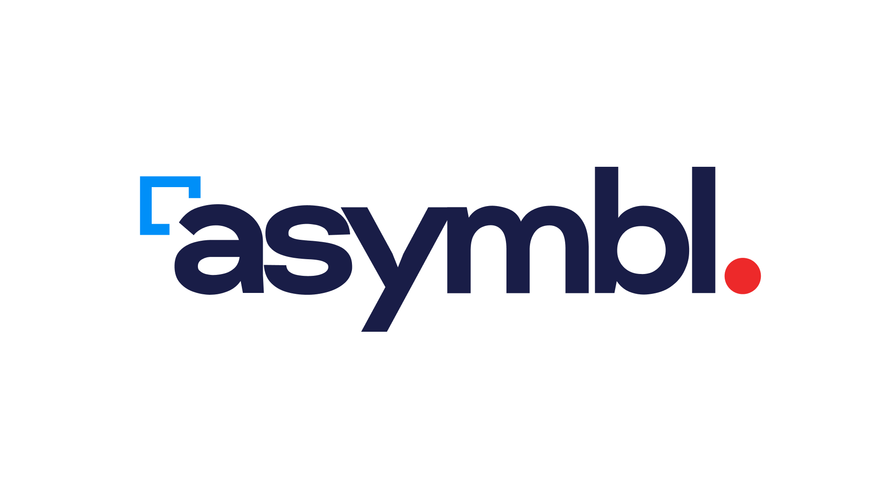

<p align="center">
  
</p>

<div align="center">



# Forge

**Asymbl's internal platform for AI agent operations.**

Assign tasks to AI coding agents the same way you'd assign to a teammate. They pick up the work, write code, report blockers, and update statuses autonomously.

[](https://github.com/shivasymbl/forge/actions/workflows/deploy.yml)

[forge.asymbl.app](https://forge.asymbl.app) · [Releases](https://github.com/shivasymbl/forge/releases) · [Spec](docs/spec/active/2026-05-01-forge/)

</div>

## What is Forge?

Forge turns AI coding agents into real teammates on Asymbl projects. Assign an issue to an agent like you'd assign to a colleague — they pick up the work, execute it, post comments, and report blockers. Built on top of the [Multica](https://github.com/multica-ai/multica) open-source platform, rebranded and self-hosted for Asymbl.

Works with **Claude Code**, **Codex**, **Gemini**, **OpenClaw**, **Hermes**, and any ACP-compatible agent.

<p align="center">
  
</p>

## Access

- **Web app:** [forge.asymbl.app](https://forge.asymbl.app)
- **Sign in:** `@asymbl.com` email only — OTP sent via Resend
- **Desktop app:** download from [Releases](https://github.com/shivasymbl/forge/releases)

---

## Quick Install

### Desktop app (macOS arm64)

1. Download **forge-desktop-0.1.0-mac-arm64.dmg** from [Releases](https://github.com/shivasymbl/forge/releases)
2. Open the DMG → drag **Forge** to Applications
3. First launch: right-click → Open (bypasses unsigned app warning)
4. Sign in with your `@asymbl.com` email

### CLI (macOS / Linux)

```bash
curl -fsSL https://raw.githubusercontent.com/shivasymbl/forge/main/scripts/install.sh | bash
forge setup self-host --server-url https://forge.asymbl.app
```

---

## Getting Started

### 1. Connect your runtime

The daemon runs on your machine and auto-detects agent CLIs (`claude`, `codex`, `gemini`, `openclaw`, `hermes`) on your PATH.

```bash
forge setup self-host --server-url https://forge.asymbl.app
forge daemon status
```

Or use the **Desktop app** — daemon is built in, zero setup.

### 2. Verify your runtime

Open [forge.asymbl.app](https://forge.asymbl.app) → **Settings → Runtimes** — your machine should appear as an active runtime.

### 3. Create an agent

**Settings → Agents → New Agent** — pick your runtime and provider. Give it a name.

### 4. Assign your first task

Create an issue, assign it to the agent. It picks up the task, executes it, and reports progress — just like a human teammate.

---

## CLI Reference

| Command | Description |
|---------|-------------|
| `forge login` | Authenticate with forge.asymbl.app |
| `forge daemon start` | Start the local agent runtime |
| `forge daemon status` | Check daemon status |
| `forge setup self-host` | One-command setup for Forge |
| `forge issue list` | List issues in your workspace |
| `forge issue create` | Create a new issue |
| `forge update` | Update to the latest version |

---

## Architecture

```
┌──────────────┐     ┌──────────────┐     ┌──────────────────┐
│   Next.js    │────>│  Go Backend  │────>│   PostgreSQL     │
│   Frontend   │<────│  (Chi + WS)  │<────│   (pgvector)     │
└──────────────┘     └──────┬───────┘     └──────────────────┘
                            │
                     ┌──────┴───────┐
                     │ Agent Daemon │  ← runs on your machine
                     └──────────────┘     or a remote droplet
                                          (Claude Code, Codex,
                                          Gemini, OpenClaw, Hermes)
```

| Layer | Stack |
|-------|-------|
| Frontend | Next.js 16 (App Router) |
| Backend | Go (Chi router, sqlc, gorilla/websocket) |
| Database | PostgreSQL 17 with pgvector |
| Hosting | DigitalOcean droplet (sfo3) behind Cloudflare Tunnel |
| CI/CD | Depot CI → GHCR → SSH deploy |

---

## Infrastructure

| Component | Detail |
|-----------|--------|
| **URL** | forge.asymbl.app |
| **Droplet** | `s-2vcpu-4gb` · sfo3 · `209.38.78.178` |
| **Images** | `ghcr.io/shivasymbl/forge-{backend,web}` |
| **Secrets** | Doppler `forge/prd` |
| **Email** | `forge@asymbl.app` via Resend |
| **Auth** | `@asymbl.com` domain only |

---

## Development

**Prerequisites:** Node.js v22+, pnpm v10.28+, Go v1.26+, Docker

```bash
make dev
```

`make dev` creates the env, installs deps, starts the DB, runs migrations, and launches all services.

### Deploying

Every push to `main` or `plan/forge-asymbl-fork` triggers a Depot CI run:
1. Builds backend + frontend images in parallel (no local Docker needed)
2. Pushes to `ghcr.io/shivasymbl/forge-*`
3. SSH deploys to the droplet with zero-downtime restart
4. Smoke-tests `forge.asymbl.app`

### Building the desktop app

```bash
pnpm --filter @asymbl/forge-desktop package
```

Requires Electron binary in `~/Library/Caches/electron/`. Set `ELECTRON_CACHE=~/Library/Caches/electron` if needed.

---

## Based on Multica

Forge is a fork of [Multica](https://github.com/multica-ai/multica) (Apache 2.0 with modifications). Upstream security patches are cherry-picked monthly. Internal use only — not offered to external clients.
